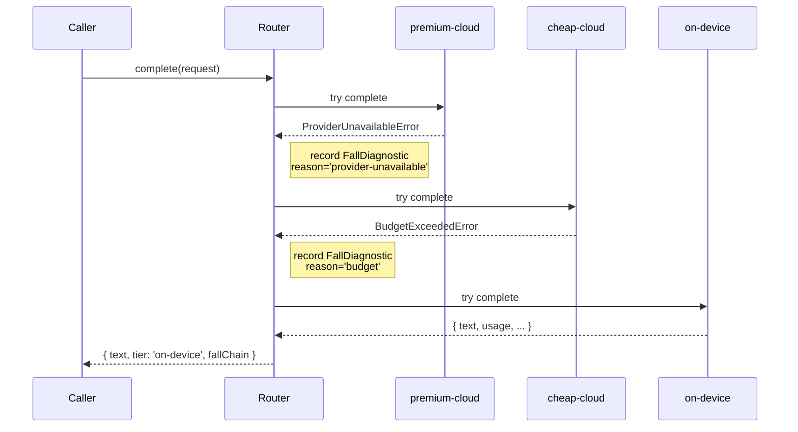

## The rule

When the router can't get a response from an adapter, it tries the next-cheapest one. It never tries the next-more-expensive one. This is *the* design constraint — the whole library is named for it.

A "fall" happens when an adapter's `complete()` throws. The router catches, records what went wrong in a `FallDiagnostic`, and advances to the next adapter in the constructor-supplied list. If every adapter fails, the router throws `NoTierAvailableError` carrying the full chain of diagnostics.

## Why falling is safe

Two properties make falling toward cheaper safe by default:

1. **Cost composes monotonically.** If a premium adapter triggers `BudgetExceededError`, falling to a cheaper tier reduces budget pressure. Climbing the other direction can only make it worse.
2. **Availability composes too.** A premium provider being unreachable is independent of the cheap provider's availability — they're different infrastructure. Falling buys you a fresh availability roll. Climbing doesn't.

Climbing would require an explicit "I know this is more expensive but I want the capability" hint. v0.1 doesn't ship that escape hatch; it's not in the v0.2–v1.0 roadmap either.

## Filter vs fall — they look similar but they're different

This is the most common source of confusion when reading a `fallChain`. They produce similar end-states ("the request landed on a cheaper tier than the user expected") but mechanically they're separate, and the diagnostic chain tells you which one happened.

| | Filter | Fall |
|---|---|---|
| Who does it | `DefaultPolicy.evaluate` | `Router.complete` |
| When | Before any HTTP | After adapter throws |
| Recorded in `fallChain` | No (silent) | Yes (one entry per fall) |
| Why | Capability / budget pre-flight | Runtime failure |

If a request has `requires.tools: true`, the policy excludes adapters whose `capability.supportsTools` is `false` — the router never sees them, so it can't record falling past them. Conversely, if an adapter passes the policy filter but then throws at runtime, the router records the fall in `fallChain` so you can see exactly what happened.

## How the router falls



## What triggers a fall

Adapters throw one of four typed errors. The router maps each to a `FallDiagnostic.reason`:

| Adapter throws | Router records `reason` |
|---|---|
| `BudgetExceededError` | `'budget'` |
| `CapabilityMismatchError` | `'capability'` |
| `ProviderUnavailableError` | `'provider-unavailable'` |
| Anything else (e.g., `TypeError`) | `'unknown'` |

The fallback `'unknown'` matters because adapter code crosses package boundaries and `instanceof` can fail in dual-package-hazard environments. The router uses `instanceof` AND error `name` string matching to classify — `'unknown'` only fires when neither identifies the error.

## When all adapters fail

```ts
import { NoTierAvailableError, formatFallChain } from '@tierfall/core';

try {
  const response = await router.complete(request);
  return response;
} catch (err) {
  if (err instanceof NoTierAvailableError) {
    console.error('All adapters failed:');
    console.error(formatFallChain(err.fallChain));
  }
  throw err;
}
```

`NoTierAvailableError.fallChain` carries every attempt. `formatFallChain` renders it as a human-readable multi-line string for logs.

## What climbing would require

A climbing API would need to ratchet in two directions per call — first attempt premium, fall on failure, then on the *next* call attempt premium again (not start where we left off). v0.1 doesn't support this; we'd need an explicit policy override like `forceTier: 'premium-cloud'` that future versions can introduce without breaking the fall-never-climb default.

## Read next

- [Policy](/docs/concepts/policy) — how filtering happens before the router gets the request
- [Budget-aware routing](/docs/recipes/budget-aware-routing) — fall in action
