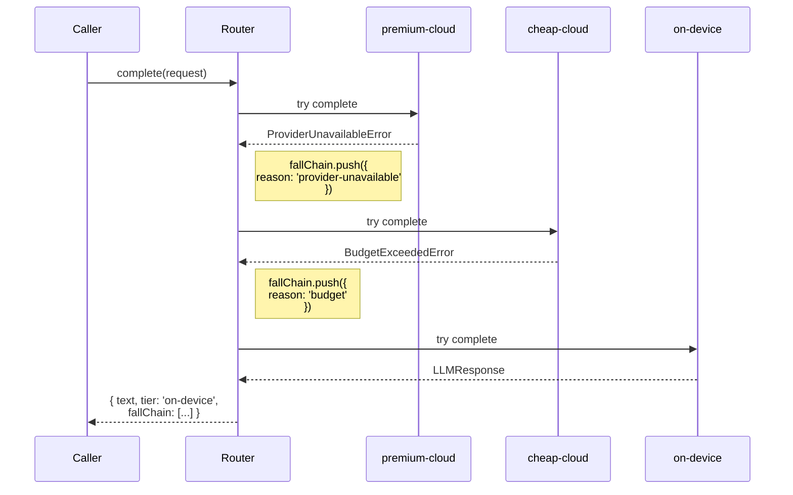
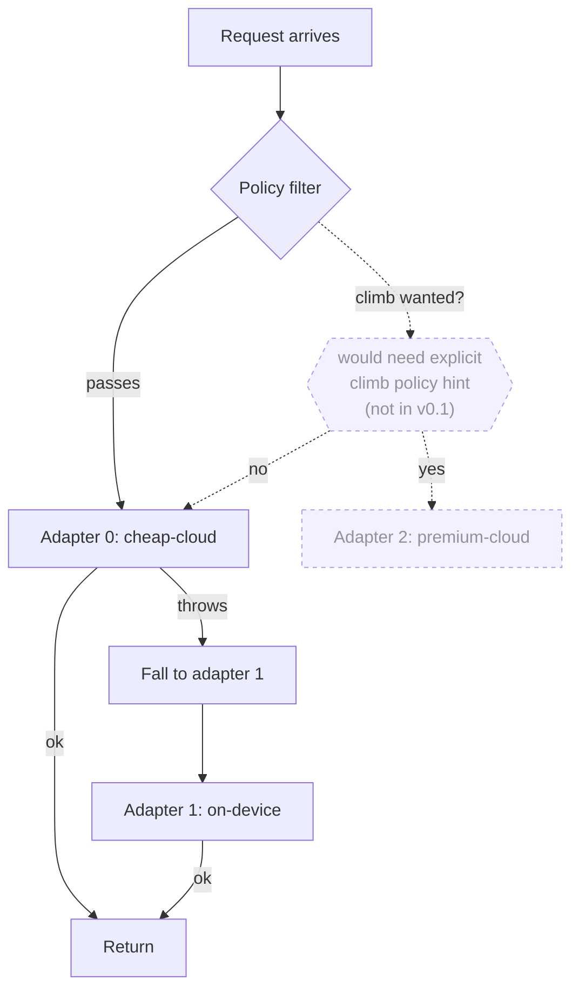

The companion page [Fall, never climb](./fall-never-climb) defines the rule and the mechanism. This page is the reasoning — why TierFall is shaped this way and what goes wrong with the alternative.

## The implicit-climb failure modes

A naïve "smart" router upgrades to a stronger model when the cheap one's response looks suspicious — short, off-topic, low-confidence. The usual marketing argument is "best of both worlds": cheap when easy, expensive when needed. In practice three failure modes appear, often together.

### Runaway cost

The classifier deciding whether to climb is itself an LLM call. Under load, that classifier sometimes flags benign responses as needing escalation. Each escalation doubles or triples the per-call cost. A traffic spike that would have cost $40 at the cheap tier costs $400 because the escalation rate ticked from 2% to 20% under the same load that made the cheap-tier responses look weaker.

Falling can't do this. Worst-case is on-device, which is free.

### Latency stacking

Each climb is a serial retry — call cheap, wait, evaluate, call expensive, wait. The cheap call's full latency is on the critical path even when the result is thrown away. p99 latency for "always climbs" looks like the sum of every tier's p99, not the p99 of any single tier.

Falling has the same property — but only when adapters fail, not on the happy path. A request that lands at the highest tier its policy permits incurs that tier's latency once. Falls happen exactly when the higher tier returned an error, so the wasted time was already lost.

### Capability ratchet

Once any production code path depends on a premium-tier capability — tool calls, longer context, structured output — that path can't safely fall to a cheaper tier that lacks it. Climbing routers tend to grow these dependencies silently: a developer notes "the cheap model sometimes can't do tool calls" and the system quietly relies on the climb. Six months later half the traffic is on the premium tier and nobody is sure which routes still work without it.

TierFall surfaces capability requirements via `requires.tools` / `requires.structuredOutput` on the request. The policy filters adapters that can't honor them before any HTTP call. The dependency is named, in code, not implicit in a classifier's threshold.

## Why falling composes with budgets

A budget is a downward constraint: "no more than $X." Falling moves toward cheaper, which strictly tightens the constraint. Falling never causes a budget violation that wasn't already going to happen on the more-expensive tier.

Climbing moves toward more expensive, which loosens the constraint. To make climbing safe, you have to layer an explicit cap on top — but now the budget check has to predict whether the climb will fit before the climb happens, using estimates that are usually wrong (token counts vary by 2-3× between providers for the same prompt). The budget check becomes either over-conservative (rejects valid requests) or under-conservative (occasionally blows the budget).

Falling lets the budget stay simple: a hard ceiling on the highest tier permitted at request time. The policy applies it once, up front. Everything below that ceiling is fair game.

## Observable by default

Every fall is a `FallDiagnostic` entry in the response's `fallChain`. The chain shows the order, the reason (`budget` / `capability` / `provider-unavailable` / `unknown`), and the adapter name. In production telemetry, that's what you sample.

Climbing routers have to invent observability — the classifier's confidence, the threshold, the upgrade decision. With falling, the observable IS the mechanism. There's nothing extra to instrument.

```ts
// Production logger example. The fallChain is the audit trail.
const response = await router.complete(request);

logger.info('llm.response', {
  tier: response.tier,
  fall_count: response.fallChain.length,
  fall_reasons: response.fallChain.map((d) => d.reason),
});
```

A request that landed at `on-device` with a fallChain of `['provider-unavailable', 'budget']` says exactly what happened: premium was down, cheap-cloud was out of budget, Ollama answered. No interpretation required.

## How the router falls



The chain is the ground truth — it's literally the sequence the router executed, not a reconstruction.

## Why climbing requires explicit policy



The dashed branch shows the climb path that would have to be reintroduced explicitly. v0.1 simply doesn't have it. The router's behavior is fully described by the fall arrows.

The reason for the explicit gate: every climb path is a place where cost can leak. A library that climbs by default puts the cost-leak surface area inside the library; a library that requires the caller to ask for the climb puts it in the application code, where it's visible.

## When you'd actually want to climb

There are real reasons:

- **A specific capability the cheap tier doesn't expose.** Tool calls in v0.4, vision in a future release.
- **Quality-sensitive single-shot interactions.** A user-facing summary worth more than the cost difference.
- **Explicit user choice.** "Use my best model."

Each of these is a place where the caller knows something the router doesn't. They want the climb. In a future version, an explicit `climbTo: 'premium-cloud'` hint on the request would carry that intent — and it would still be checked against the policy's budget. There's no design tension here; the gate is the point.
