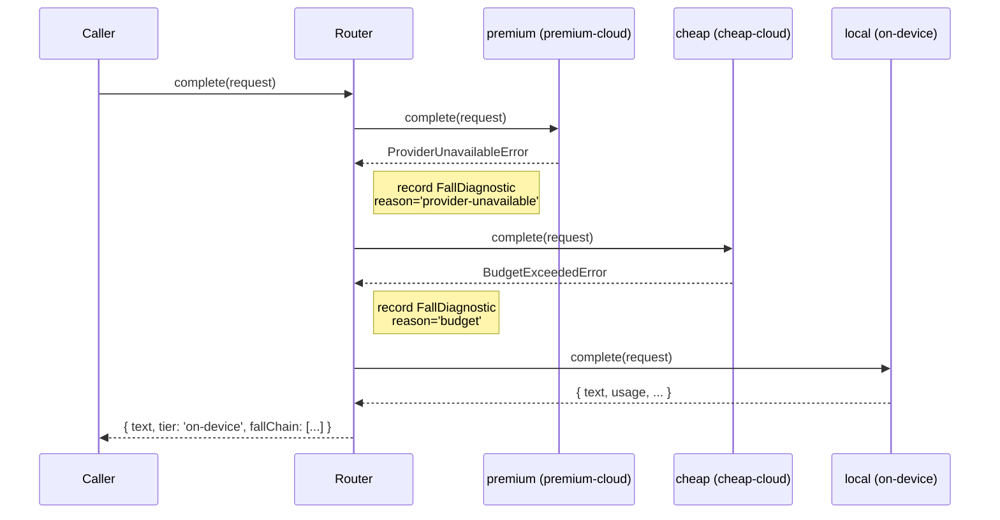

# Fumadocs v0.1 Content — Design Spec

**Date:** 2026-05-20
**Status:** Draft — awaiting user review
**Issue:** [#10 — docs: write Fumadocs v0.1 content](https://github.com/tierfall/tierfall/issues/10)
**Scope:** Replace the 2 placeholder MDX files in `apps/docs/content/docs/` with 10 substantive v0.1 docs pages. Add 3 new directory meta.json files. Site must build via `pnpm --filter @tierfall-app/docs build` with zero warnings.

---

## 1. Goal

Ship user-facing documentation for v0.1. After this PR, `apps/docs` renders 10 pages that explain TierFall to someone seeing it for the first time and serve as reference for someone building against it.

This is the last `p1` work blocking the v0.1 release. After it lands, the natural next step is a `develop → main` release PR.

## 2. Sitemap

```
content/docs/
├── meta.json                          # top-level nav
├── index.mdx                          # landing — pitch + status + install
├── getting-started.mdx                # local install + first request + demo
├── concepts/
│   ├── meta.json                      # nav for /docs/concepts
│   ├── tiers.mdx                      # the four tiers + examples
│   ├── fall-never-climb.mdx           # routing thesis + filter-vs-fall + Mermaid diagram
│   └── policy.mdx                     # DefaultPolicy DSL + filters + sort
├── reference/
│   ├── meta.json                      # nav for /docs/reference (new directory)
│   ├── adapter.mdx                    # Adapter interface contract for adapter authors
│   ├── adapter-ollama.mdx             # @tierfall/adapter-ollama
│   ├── adapter-openai-compatible.mdx  # + /presets sub-export
│   └── adapter-anthropic.mdx          # @tierfall/adapter-anthropic
└── recipes/
    ├── meta.json                      # nav for /docs/recipes (new directory)
    └── budget-aware-routing.mdx       # showing budget filter in action
```

**14 files total:**

- 10 MDX (1 new index replace, 1 new tiers replace, 8 new)
- 4 meta.json (top-level update, concepts update, reference new, recipes new)

## 3. Sidebar order

**Top-level (`content/docs/meta.json`):**

```json
{ "title": "TierFall", "pages": ["index", "getting-started", "concepts", "reference", "recipes"] }
```

**Concepts (`content/docs/concepts/meta.json`):**

```json
{
  "title": "Concepts",
  "pages": ["tiers", "fall-never-climb", "policy"]
}
```

Read-in-order: tiers (what the words mean) → fall-never-climb (why) → policy (how filtering happens).

**Reference (`content/docs/reference/meta.json`):**

```json
{
  "title": "Reference",
  "pages": ["adapter", "adapter-ollama", "adapter-openai-compatible", "adapter-anthropic"]
}
```

Interface first, then implementations.

**Recipes (`content/docs/recipes/meta.json`):**

```json
{
  "title": "Recipes",
  "pages": ["budget-aware-routing"]
}
```

Only one recipe in v0.1; more land via subsequent PRs.

## 4. Content style

- **Terse, technical, present-tense.** No marketing copy. No emoji.
- **Snippet beats prose** where the snippet is clearer.
- **Cross-link liberally** — every concept links to siblings; every adapter reference links to the interface + the relevant tier doc.
- **No `// TODO: implement` placeholders** anywhere. Code examples use real APIs that work today.
- **TSDoc-mirroring** — when documenting an exported symbol, use the same example shape that lives in the source file's `@example` block, so doc + code can't drift.

## 5. Target lengths per page

| Page                                      | Target lines | Why                                              |
| ----------------------------------------- | ------------ | ------------------------------------------------ |
| `index.mdx`                               | ~60          | Landing — pitch + status + install               |
| `getting-started.mdx`                     | ~120         | Walkthrough — needs prose                        |
| `concepts/tiers.mdx`                      | ~80          | Table-driven                                     |
| `concepts/fall-never-climb.mdx`           | ~100         | Argument prose + Mermaid diagram                 |
| `concepts/policy.mdx`                     | ~90          | Filter table                                     |
| `reference/adapter.mdx`                   | ~80          | Interface; code-heavy                            |
| `reference/adapter-ollama.mdx`            | ~70          | Pulls from CLAUDE.md gotchas                     |
| `reference/adapter-openai-compatible.mdx` | ~100         | Heavier — /presets sub-export + 5 preset configs |
| `reference/adapter-anthropic.mdx`         | ~80          | Same as Ollama; emphasizes system extraction     |
| `recipes/budget-aware-routing.mdx`        | ~70          | One concrete example end-to-end                  |

**~850 lines of MDX total.**

## 6. Content sources

Every page draws from one or more **existing canonical sources** — no speculation about API surface:

| Page                                      | Primary sources                                                                                                      |
| ----------------------------------------- | -------------------------------------------------------------------------------------------------------------------- |
| `index.mdx`                               | Root `README.md` + brainstorm spec §1                                                                                |
| `getting-started.mdx`                     | demo's `apps/demo-cli/README.md` (Compose run) + first-request snippet from `packages/core/src/router.ts` `@example` |
| `concepts/tiers.mdx`                      | `packages/core/src/tier.ts` (TIERS array + AdapterCapability) + bootstrap spec §3.2                                  |
| `concepts/fall-never-climb.mdx`           | Bootstrap spec §3.7 + Router state machine narrative + demo Scenario 2's filter-vs-fall narration                    |
| `concepts/policy.mdx`                     | DefaultPolicy spec §3 algorithm, §4 filter table + `estimateCost` formula                                            |
| `reference/adapter.mdx`                   | `packages/core/src/adapter.ts` (the `Adapter` interface) + per-adapter implementation contract                       |
| `reference/adapter-ollama.mdx`            | `packages/adapter-ollama/CLAUDE.md` gotchas + constructor signature + capability defaults                            |
| `reference/adapter-openai-compatible.mdx` | `packages/adapter-openai-compatible/CLAUDE.md` + 5 preset configs from `presets.ts`                                  |
| `reference/adapter-anthropic.mdx`         | `packages/adapter-anthropic/CLAUDE.md` gotchas + constructor signature + capability defaults                         |
| `recipes/budget-aware-routing.mdx`        | Demo scenario 2 + DefaultPolicy filter behavior                                                                      |

## 7. Critical cross-links

Every concept page footer: "See also: [other concepts]".
Every adapter reference page footer: "See also: [Adapter interface](/docs/reference/adapter), [Tiers](/docs/concepts/tiers)".
Recipes page links to `concepts/fall-never-climb` and `concepts/policy`.

## 8. The Mermaid diagram in `fall-never-climb.mdx`

Fumadocs 16 supports Mermaid via fenced code blocks (`\`\`\`mermaid`). One diagram showing a fall sequence:



This visualizes the fall semantics in one shot — useful for the page that justifies the design.

## 9. Files changed

| File                                                             | Operation                                                             |
| ---------------------------------------------------------------- | --------------------------------------------------------------------- |
| `apps/docs/content/docs/meta.json`                               | Modify (add `getting-started`, `reference`, `recipes` to pages array) |
| `apps/docs/content/docs/index.mdx`                               | Rewrite (currently placeholder)                                       |
| `apps/docs/content/docs/getting-started.mdx`                     | Create                                                                |
| `apps/docs/content/docs/concepts/meta.json`                      | Modify (add `fall-never-climb`, `policy` to pages)                    |
| `apps/docs/content/docs/concepts/tiers.mdx`                      | Rewrite (currently placeholder)                                       |
| `apps/docs/content/docs/concepts/fall-never-climb.mdx`           | Create                                                                |
| `apps/docs/content/docs/concepts/policy.mdx`                     | Create                                                                |
| `apps/docs/content/docs/reference/meta.json`                     | Create                                                                |
| `apps/docs/content/docs/reference/adapter.mdx`                   | Create                                                                |
| `apps/docs/content/docs/reference/adapter-ollama.mdx`            | Create                                                                |
| `apps/docs/content/docs/reference/adapter-openai-compatible.mdx` | Create                                                                |
| `apps/docs/content/docs/reference/adapter-anthropic.mdx`         | Create                                                                |
| `apps/docs/content/docs/recipes/meta.json`                       | Create                                                                |
| `apps/docs/content/docs/recipes/budget-aware-routing.mdx`        | Create                                                                |

No source changes outside `apps/docs/`. No changeset.

## 10. Commit plan

**1-2 commits:**

1. **`docs(docs): write v0.1 Fumadocs content`** — all 14 files.
2. (optional) **`docs(docs): fix sidebar / build issues found in QA`** — only if `pnpm --filter @tierfall-app/docs build` surfaces issues after Commit 1.

## 11. Verification

- `pnpm --filter @tierfall-app/docs build` exits 0
- **Zero warnings** in the build output (per AC explicit ask)
- `pnpm --filter @tierfall-app/docs dev` renders all 10 pages locally (manual spot-check; can defer if no time)
- All cross-links resolve (no 404s on the rendered site)

## 12. Acceptance criteria mapping

| AC from issue #10                                                                                                                               | How met                                              |
| ----------------------------------------------------------------------------------------------------------------------------------------------- | ---------------------------------------------------- |
| `content/docs/index.mdx` — TierFall pitch, current status, install snippet                                                                      | §6 sources; landing page                             |
| `content/docs/getting-started.mdx` — local install, demo, first request                                                                         | §6 sources; walkthrough page                         |
| `content/docs/concepts/tiers.mdx` — the four tiers, with examples                                                                               | Table-driven; replaces placeholder                   |
| `content/docs/concepts/fall-never-climb.mdx` — the routing thesis                                                                               | §8 Mermaid diagram + filter-vs-fall narration        |
| `content/docs/concepts/policy.mdx` — policy DSL                                                                                                 | DefaultPolicy filter table + estimateCost            |
| `content/docs/reference/adapter.mdx` — Adapter interface contract                                                                               | §6 sources; interface page                           |
| `content/docs/reference/adapter-ollama.mdx`, `adapter-openai-compatible.mdx`, `adapter-anthropic.mdx` — per-adapter install + config + defaults | One per adapter; pulls from each package's CLAUDE.md |
| `content/docs/recipes/budget-aware-routing.mdx` — budget fall example                                                                           | One concrete recipe                                  |
| Site builds via `pnpm --filter @tierfall-app/docs build` with zero warnings                                                                     | §11 verification                                     |

## 13. Out of scope

- **Search** (Fumadocs has built-in search) — works out-of-box once content exists; no config needed
- **API docs from TSDoc** (e.g., via `typedoc` + `fumadocs-typescript`) — future polish; v0.1 is hand-written reference
- **Light-mode/dark-mode tweaks** — Fumadocs defaults
- **Site deployment to `docs.tierfall.dev`** — out-of-band (Vercel / Cloudflare Pages setup); the build artifact is what this PR ships
- **Streaming docs** — v0.4 alongside the implementation
- **Tool-calling docs** — v0.4

## 14. Risks

- **MDX syntax in code blocks.** Triple-backticks inside MDX work but content like `` ` `` inside text needs escaping. Will verify in build.
- **Mermaid rendering.** Fumadocs 16's Mermaid support is via plugin or markdown processor. If `\`\`\`mermaid`doesn't render natively, fall back to an image OR install`fumadocs-twoslash`-style integration. **Decision:** if Mermaid doesn't work in fumadocs-mdx, ship without the diagram and note as a follow-up. Don't block the PR on it.
- **Meta.json key naming.** Fumadocs uses file basenames for pages array. Verify by reading existing `concepts/meta.json` from scaffolding which uses `["tiers"]`.
- **Cross-link path format.** Fumadocs uses `/docs/concepts/tiers` style absolute paths. Verify by inspection of the rendered site.

## 15. Notable decisions

- **No tutorial-style "Build a chatbot in 5 minutes" page** — v0.1 stays focused on what TierFall is/does. Tutorials are v0.4+ when more features exist.
- **Reference pages are flat** — one page per adapter package, not nested per-method. Adapters have one method.
- **Recipes is just one page in v0.1** — `budget-aware-routing`. Future PRs add `multi-region`, `cost-tracking`, `streaming` (when implemented), etc.
- **No badge/footer convention** — Fumadocs defaults look fine; future PR can add custom UI if wanted.
